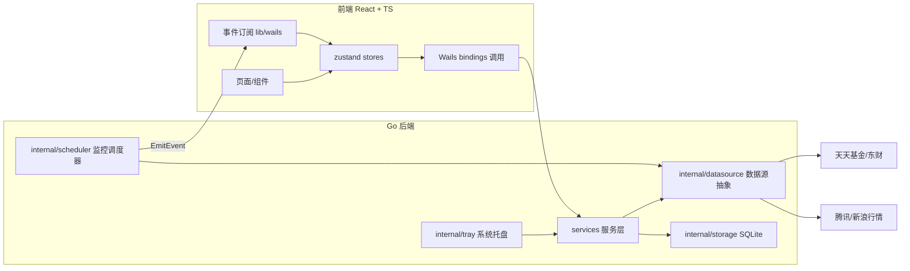
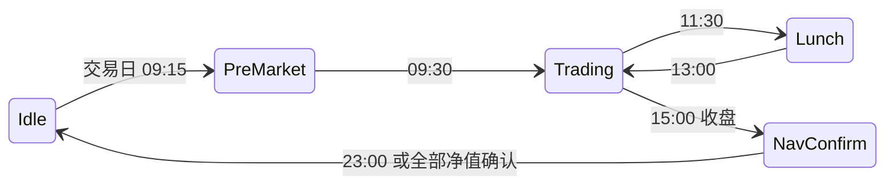

# MiniFund 技术设计文档

> 版本：v1.0 ｜ 更新日期：2026-06-12
>
> 技术栈：Wails v3（alpha）+ Go 1.26 + React 18 + TypeScript + Vite + Tailwind CSS + zustand。
> 工程结构与编码风格对齐 MiniDB 项目。

## 1. 总体架构



核心原则：

1. **单一数据通道**：所有网络请求只发生在 Go 侧 `datasource` 层；前端永不直连外部接口（规避 CORS 与 UA 限制，统一限频）。
2. **推拉结合**：用户操作走 bindings 调用（拉）；周期性数据（估值/指数）由调度器统一拉取后用事件广播（推），所有窗口共享同一事件流。
3. **解析隔离**：非官方接口的解析逻辑全部收敛在 `datasource/*` 子包，上层依赖 Go interface，接口失效只改一处。

## 2. 目录结构

```
MiniFund/
├── main.go                     # 入口：嵌入前端资源，启动 app
├── go.mod
├── Taskfile.yml                # wails3 任务编排
├── build/                      # wails3 构建配置（config.yml、Info.plist、图标）
├── AGENTS.md                   # 代理开发验证规则
├── .cursor/rules/              # Cursor 项目规则
├── docs/                       # 本系列文档
├── internal/
│   ├── app/                    # 应用装配：core.go（服务装配）、runner.go（Wails 启动）、windows.go（窗口工厂）
│   ├── config/                 # 应用路径、常量
│   ├── logger/                 # 文件日志（对齐 MiniDB 实现）
│   ├── storage/                # SQLite 封装与迁移
│   ├── datasource/             # 数据源抽象层
│   │   ├── types.go            # 领域模型 + Source 接口定义
│   │   ├── eastmoney/          # 天天基金/东财实现（估值、净值、详情、排行、板块、代码表）
│   │   ├── tencent/            # 腾讯指数行情实现
│   │   └── sina/               # 新浪指数行情实现（降级备源）
│   ├── scheduler/              # 监控调度器：时段状态机、交易日历、轮询任务
│   ├── tray/                   # 系统托盘：图标、标题刷新、菜单、面板窗口联动
│   └── version/                # 版本信息
├── services/                   # Wails 服务层（暴露给前端的 API）
│   ├── fund_service.go         # 搜索、详情、历史净值、排行
│   ├── watchlist_service.go    # 自选与分组 CRUD
│   ├── portfolio_service.go    # 持仓 CRUD 与盈亏计算
│   ├── market_service.go       # 指数行情、板块行情
│   ├── alert_service.go        # 提醒规则与触发历史（v1.1）
│   ├── settings_service.go     # 设置读写
│   └── window_service.go       # 多窗口管理（打开详情窗口等）
└── frontend/
    ├── package.json / vite.config.ts / tailwind.config.js / tsconfig.json
    └── src/
        ├── main.tsx            # 按 hash 路由分发窗口入口
        ├── windows/            # 每个窗口一个根组件：MainWindow / TrayPanel / DetailWindow
        ├── components/
        │   ├── ui/             # 通用组件（button/input/badge/tooltip/...）
        │   ├── layout/         # 主窗口布局（Sidebar/Toolbar/TitleBar）
        │   ├── fund/           # 基金业务组件（自选表格/详情/搜索面板）
        │   └── market/         # 指数条、板块热力
        ├── stores/             # zustand：watchlist/portfolio/market/settings/theme/ui
        ├── lib/                # utils、wails 事件封装、格式化（涨跌色/金额）
        ├── hooks/
        ├── types/
        └── i18n/               # v1 仅中文，预留结构
```

## 3. 数据源抽象层（internal/datasource）

```go
// 估值数据源接口（涨跌幅等数值统一用字符串原样保留 + 解析后的 float64 双字段，避免精度歧义）
type FundQuoteSource interface {
    // 批量获取盘中估值（内部并发，并发度 ≤ 8）
    FetchEstimates(ctx context.Context, codes []string) ([]FundEstimate, error)
}

type IndexQuoteSource interface {
    FetchIndexQuotes(ctx context.Context, symbols []string) ([]IndexQuote, error)
}
```

- `eastmoney` 包实现：估值（fundgz）、代码表（fundcode_search）、历史净值（f10/lsjz）、详情（pingzhongdata + jjcc）、排行（rankhandler）、板块（push2）。
- `tencent`/`sina` 实现 `IndexQuoteSource`，由 `FallbackIndexSource` 组合器做主备切换与退避。
- 公共设施：带 UA/Referer 的 `http.Client`（超时 5s）、JSONP/JS 变量解析工具、GBK 解码、令牌桶限频器、熔断器（连续 5 次失败暂停 5 分钟）。

## 4. 监控调度器（internal/scheduler）

### 4.1 时段状态机



- 状态机基于本地时钟 + 内置 A 股交易日历（`calendar.go`，年度节假日表，周末排除）。
- 每个状态决定两个轮询任务的开关与周期：
  - `estimateTask`：自选基金估值（Trading 30s 默认，托盘面板打开时 15s；QDII 排除）
  - `indexTask`：指数行情（Trading 10s，Lunch/盘后按订阅市场降频）
- `NavConfirm` 任务：每 10 分钟查历史净值接口首条记录，日期为今日则确认净值、发事件、停止该基金查询。
- 暴露 `Pause()/Resume()`（托盘菜单"暂停监控"）与 `SetInterval()`（设置页）。

### 4.2 事件协议（Go → 前端）

| 事件名 | 载荷 | 触发 |
| --- | --- | --- |
| `fund:estimates` | `FundEstimate[]` | 每轮估值拉取完成 |
| `market:indexes` | `IndexQuote[]` | 每轮指数拉取完成 |
| `fund:nav-confirmed` | `{code, date, nav, growth}` | 当日净值确认 |
| `monitor:state` | `{phase, nextChange, paused}` | 时段状态切换/暂停恢复 |
| `datasource:degraded` | `{source, reason}` | 熔断/降级发生与恢复 |

- 使用 Wails3 `application.RegisterEvent[T]` 注册强类型事件（对齐 MiniDB updater 的做法）；前端在 `lib/wails/events.ts` 统一封装订阅。

## 5. 本地存储（internal/storage，SQLite）

选型理由：相比 bbolt，自选/持仓/净值历史天然是关系结构，搜索需要 LIKE 查询，SQLite（`mattn/go-sqlite3`，MiniDB 已有依赖经验）更合适。文件位于 `~/Library/Application Support/MiniFund/minifund.db`。

```sql
-- 基金代码表（搜索索引，全量 ~2 万条）
CREATE TABLE fund_index (
  code TEXT PRIMARY KEY, name TEXT NOT NULL, type TEXT,
  pinyin_abbr TEXT, pinyin_full TEXT, updated_at INTEGER
);

-- 自选分组与条目
CREATE TABLE watch_group (id INTEGER PRIMARY KEY, name TEXT NOT NULL, sort INTEGER);
CREATE TABLE watch_item (
  code TEXT NOT NULL, group_id INTEGER NOT NULL REFERENCES watch_group(id),
  sort INTEGER, pinned INTEGER DEFAULT 0, created_at INTEGER,
  PRIMARY KEY (code, group_id)
);

-- 持仓（v1 每基金一条，可编辑；v2 扩展为交易流水表）
CREATE TABLE position (
  code TEXT PRIMARY KEY, shares REAL NOT NULL, cost_price REAL NOT NULL, updated_at INTEGER
);

-- 当日收益落库（净值确认后写入，供 v2 收益日历）
CREATE TABLE daily_profit (
  code TEXT, date TEXT, nav REAL, growth REAL, profit REAL,
  PRIMARY KEY (code, date)
);

-- 净值历史缓存 / 详情快照缓存（带时效）
CREATE TABLE nav_history (code TEXT, date TEXT, nav REAL, acc_nav REAL, growth REAL, PRIMARY KEY (code, date));
CREATE TABLE detail_cache (code TEXT PRIMARY KEY, payload TEXT, fetched_at INTEGER);

-- 设置（KV）
CREATE TABLE settings (key TEXT PRIMARY KEY, value TEXT);

-- 提醒规则与触发历史（v1.1）
CREATE TABLE alert_rule (
  id INTEGER PRIMARY KEY, code TEXT, kind TEXT, threshold REAL,
  enabled INTEGER DEFAULT 1, last_fired_date TEXT
);
CREATE TABLE alert_log (id INTEGER PRIMARY KEY, rule_id INTEGER, fired_at INTEGER, message TEXT);
```

- 迁移机制：`storage/migrations.go` 内置版本号顺序执行（`PRAGMA user_version`）。

## 6. 多窗口设计

### 6.1 窗口清单与路由

| 窗口 ID | URL（hash 路由） | 尺寸 | 特性 |
| --- | --- | --- | --- |
| `main` | `/#/main` | 1180×760（min 960×600） | frameless、透明背景、记忆位置 |
| `tray-panel` | `/#/tray` | 320×420 固定 | frameless、AlwaysOnTop、隐藏任务栏、失焦隐藏 |
| `detail:{code}` | `/#/detail/{code}` | 900×680 | 按基金代码复用已开窗口 |

- 前端单一构建产物，`main.tsx` 读取 `location.hash` 决定渲染 `windows/` 下哪个根组件；窗口间不共享 React 状态，各自订阅 Go 事件保证一致。
- `window_service.go` 提供 `OpenDetailWindow(code)`、`ShowMainWindow()`、`ToggleTrayPanel()`，统一管理窗口实例 map（带互斥锁），关闭即从 map 删除。

### 6.2 窗口生命周期

- 主窗口关闭 → 拦截为 `Hide()`（设置项可改为真退出）；macOS `ApplicationShouldTerminateAfterLastWindowClosed: false`。
- 应用真正退出仅通过托盘菜单"退出"或 `Cmd+Q`。
- 托盘面板：`OnFocusLost` 自动 `Hide()`；显示前根据托盘图标位置定位（Wails3 `systray.AttachWindow` 能力）。

## 7. 系统托盘（internal/tray）

- 使用 Wails3 `app.SystemTray.New()`：
  - **图标**：模板图标（适配菜单栏亮暗）。
  - **标题**：调度器每轮估值后刷新被关注目标的涨跌幅文本（如 `▲1.24%`），多目标每 5s 轮播；摸鱼模式输出中性格式。
  - **左键**：`AttachWindow` 绑定托盘面板窗口，点击切换显示/隐藏。
  - **右键菜单**：显示主窗口 / 暂停（恢复）监控 / 摸鱼模式 / 设置 / 退出。
- 托盘标题更新走 `application.InvokeAsync` 确保主线程安全。

## 8. 服务层 API 草案（services/）

```go
// FundService
SearchFunds(keyword string, limit int) ([]FundIndexItem, error)
GetFundDetail(code string) (*FundDetail, error)          // 详情快照（缓存优先）
GetNavHistory(code string, page, size int) (*NavPage, error)
GetFundRanking(fundType, sortKey string, page int) (*RankPage, error)
RefreshFundIndex() error                                  // 手动更新代码表

// WatchlistService
ListGroups() / CreateGroup(name) / RenameGroup(id, name) / DeleteGroup(id)
ListItems(groupID) / AddItem(code, groupID) / RemoveItem(code, groupID)
MoveItem(code, fromGroup, toGroup) / SetPinned(code, groupID, pinned) / Reorder(groupID, codes)

// PortfolioService
GetPosition(code) / UpsertPosition(code, shares, costPrice) / DeletePosition(code)
GetSummary() (*PortfolioSummary, error)   // 总市值/当日预估/累计收益

// MarketService
GetIndexQuotes() / SetWatchedIndexes(symbols) / GetSectorList(kind string)

// SettingsService
Get() (*AppSettings, error) / Update(patch AppSettings) error

// WindowService
OpenDetailWindow(code) / ShowMainWindow() / HideMainWindow() / QuitApp()
```

- 服务注册沿用 MiniDB 装配模式：`internal/app/core.go` 构造服务 → `services()` 返回 `[]application.Service` → `runner.go` 传入 `application.Options`。

## 9. 前端状态管理（zustand stores）

| store | 职责 | 持久化 |
| --- | --- | --- |
| `theme` | 亮/暗/跟随系统、紧凑模式 | localStorage |
| `settings` | 镜像 Go 侧 AppSettings | Go SQLite（store 只缓存） |
| `watchlist` | 分组与自选列表 + 实时估值合并视图 | Go SQLite |
| `portfolio` | 持仓与盈亏汇总 | Go SQLite |
| `market` | 指数、板块、监控状态（phase） | 否（事件驱动） |
| `ui` | 面板开关、选中项、金额隐藏开关 | localStorage（部分） |

- 数据流约定：**写操作一律调用 bindings → Go 落库 → Go 发事件 → 各窗口 store 更新**，禁止前端先改本地再同步（避免多窗口状态漂移）。

## 10. 错误处理与日志

- Go 侧：`internal/logger` 文件日志（`~/Library/Logs/MiniFund/`），等级 Info/Warn/Error；service 返回 error 一律带上下文包装（`fmt.Errorf("拉取估值失败: %w", err)`）。
- 前端：bindings 调用统一经 `lib/wails/call.ts` 包装，错误 toast 提示；事件断流（>2 个周期无数据且处于 Trading）展示"数据延迟"徽标。

## 11. 构建与发布

- `wails3 dev -config ./build/config.yml` 本地开发；`wails3 build` 产出二进制；`wails3 task package:darwin ARCH=arm64` 打包 .app/DMG。
- bindings 生成：`wails3 generate bindings`（输出至 `frontend/bindings/`，提交入库）。
- 版本号集中在 `internal/version`。
