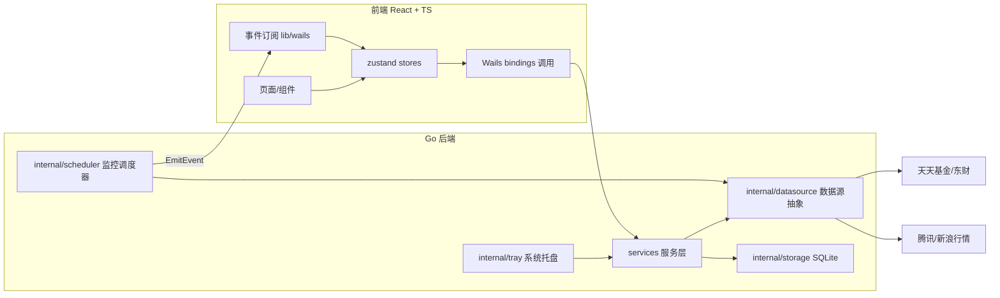
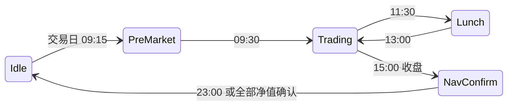

# MiniFund 技术设计文档

> 版本：v1.0 ｜ 更新日期：2026-06-12
>
> 技术栈：Wails v3（alpha）+ Go 1.26 + React 18 + TypeScript + Vite + Tailwind CSS + zustand。
> 工程结构与编码风格对齐 MiniDB 项目。

## 1. 总体架构



核心原则：

1. **单一数据通道**：所有网络请求只发生在 Go 侧 `datasource` 层；前端永不直连外部接口（规避 CORS 与 UA 限制，统一限频）。
2. **推拉结合**：用户操作走 bindings 调用（拉）；周期性数据（估值/指数）由调度器统一拉取后用事件广播（推），所有窗口共享同一事件流。
3. **解析隔离**：非官方接口的解析逻辑全部收敛在 `datasource/*` 子包，上层依赖 Go interface，接口失效只改一处。

## 2. 目录结构

```
MiniFund/
├── main.go                     # 入口：嵌入前端资源，启动 app
├── go.mod
├── Taskfile.yml                # wails3 任务编排
├── build/                      # wails3 构建配置（config.yml、Info.plist、图标）
├── AGENTS.md                   # 代理开发验证规则
├── .cursor/rules/              # Cursor 项目规则
├── docs/                       # 本系列文档
├── internal/
│   ├── app/                    # 应用装配：core.go（服务装配）、runner.go（Wails 启动）、windows.go（窗口工厂）
│   ├── config/                 # 应用路径、常量
│   ├── logger/                 # 文件日志（对齐 MiniDB 实现）
│   ├── storage/                # SQLite 封装与迁移
│   ├── datasource/             # 数据源抽象层
│   │   ├── types.go            # 领域模型 + Source 接口定义
│   │   ├── eastmoney/          # 天天基金/东财实现（估值、净值、详情、排行、板块、代码表）
│   │   ├── tencent/            # 腾讯指数行情实现
│   │   └── sina/               # 新浪指数行情实现（降级备源）
│   ├── scheduler/              # 监控调度器：时段状态机、交易日历、轮询任务
│   ├── tray/                   # 系统托盘：图标、标题刷新、菜单、面板窗口联动
│   └── version/                # 版本信息
├── services/                   # Wails 服务层（暴露给前端的 API）
│   ├── fund_service.go         # 搜索、详情、历史净值、排行
│   ├── watchlist_service.go    # 自选与分组 CRUD
│   ├── portfolio_service.go    # 持仓 CRUD 与盈亏计算
│   ├── market_service.go       # 指数行情、板块行情
│   ├── alert_service.go        # 提醒规则与触发历史（v1.1）
│   ├── settings_service.go     # 设置读写
│   └── window_service.go       # 多窗口管理（打开详情窗口等）
└── frontend/
    ├── package.json / vite.config.ts / tailwind.config.js / tsconfig.json
    └── src/
        ├── main.tsx            # 按 hash 路由分发窗口入口
        ├── windows/            # 每个窗口一个根组件：MainWindow / TrayPanel / DetailWindow
        ├── components/
        │   ├── ui/             # 通用组件（button/input/badge/tooltip/...）
        │   ├── layout/         # 主窗口布局（Sidebar/Toolbar/TitleBar）
        │   ├── fund/           # 基金业务组件（自选表格/详情/搜索面板）
        │   └── market/         # 指数条、板块热力
        ├── stores/             # zustand：watchlist/portfolio/market/settings/theme/ui
        ├── lib/                # utils、wails 事件封装、格式化（涨跌色/金额）
        ├── hooks/
        ├── types/
        └── i18n/               # v1 仅中文，预留结构
```

## 3. 数据源抽象层（internal/datasource）

```go
// 估值数据源接口（涨跌幅等数值统一用字符串原样保留 + 解析后的 float64 双字段，避免精度歧义）
type FundQuoteSource interface {
    // 批量获取盘中估值（内部并发，并发度 ≤ 8）
    FetchEstimates(ctx context.Context, codes []string) ([]FundEstimate, error)
}

type IndexQuoteSource interface {
    FetchIndexQuotes(ctx context.Context, symbols []string) ([]IndexQuote, error)
}
```

- `eastmoney` 包实现：估值（fundgz）、代码表（fundcode_search）、历史净值（f10/lsjz）、详情（pingzhongdata + jjcc）、排行（rankhandler）、板块（push2）。
- `tencent`/`sina` 实现 `IndexQuoteSource`，由 `FallbackIndexSource` 组合器做主备切换与退避。
- 公共设施：带 UA/Referer 的 `http.Client`（超时 5s，共享 keep-alive 连接池 + 透明 gzip）、JSONP/JS 变量解析工具、GBK 解码、令牌桶限频器、熔断器（连续 5 次失败暂停 5 分钟）。
- 列表性能：排行/主题/板块在 `services/` 层做 60s TTL 内存缓存（`services/cache.go`，板块按 `all`/`industry`/`concept` 分键），并在启动时后台预加载（`FundService.PreloadRanking` / `MarketService.PreloadMarket` 预热「概念板块」热力）。
- 板块热力（`SectorPage`，导航名「热门主题」）：行业(`m:90+t:2`)+概念(`m:90+t:3`) 合并为「全部」（默认概念），**按 `pn` 分页拉全（push2 单页上限 100）**，阶段取 push2 原生 `f3`/`f24`/`f25`（今日/近3月/今年来），按涨跌幅或主力净流入(`f62`)排序着色；点击板块尽力匹配 `FundTopicInterface` 主题，未命中则浏览器打开东财板块页。
- 排行规模：`rankhandler` 无规模字段，`FetchRanking` 拉到一页后用 `FundMNFInfo` 批量取 `ENDNAV` 补全 `RankItem.Scale`；详情页历史最大回撤由 `Data_netWorthTrend` 单位净值序列计算（`calcMaxDrawdown`）。
- macOS 打包：`wails3 task darwin:package ARCH=arm64` 生成带图标的 `.app`（codesign 前先 `xattr -cr` 清扩展属性，否则报 "detritus not allowed"）；`open bin/minifund.app` 以 .app 形式启动。

## 4. 监控调度器（internal/scheduler）

### 4.1 时段状态机



- 状态机基于本地时钟 + 内置 A 股交易日历（`calendar.go`，年度节假日表，周末排除）。
- 每个状态决定两个轮询任务的开关与周期：
  - `estimateTask`：自选基金估值（Trading 30s 默认，托盘面板打开时 15s；QDII 排除）。每轮估值后调用 `reconcileEstimates`，用权威历史净值（`latestNavCache`，TTL 5 分钟 + 自选集合变化才重拉，批量 `eastmoney.FetchLatestNavs` 并发 ≤ 8）校正 `fundgz` 滞后：「最新净值」改取历史净值最新一条；估算对应交易日（`gztime` 日期）≤ 最新已确认净值日期时清除过期估算（`HasEstimate=false`）。同时把历史净值最新一条的日增长率写入 `FundEstimate.DayGrowth`（`HasDayGrowth=true`），作为自选列表「今日涨幅」在盘后/非交易日的兜底（前端优先实时估算、否则取已公布日涨幅）。
  - `indexTask`：指数行情（Trading 10s，Lunch/盘后按订阅市场降频）
- `NavConfirm` 任务：每 10 分钟查历史净值接口首条记录，日期为今日则确认净值、发事件、停止该基金查询；同时把该基金估值缓存的最新净值更新为确认值并清除已被取代的盘中估算。
- 定投到期任务（`runDCARound`）：主循环每**自然日一次**（按日期去重，独立于交易时段/暂停）调用 `store.DueDCAPlans(today)`；到期计划若开启 `auto_record` 则取最新净值（`eastmoney.FetchLatestNavs`）按 金额÷净值 估算份额写入一笔 `dca` 来源买入流水并重算持仓，始终经注入的 `dcaNotify` 回调发桌面通知提醒，随后 `AdvanceDCAPlan` 推进 `next_run`，最后广播 `watchlist:changed` 让各窗口重载。
- 暴露 `Pause()/Resume()`（托盘菜单"暂停监控"）与 `SetInterval()`（设置页）。

### 4.2 事件协议（Go → 前端）

| 事件名 | 载荷 | 触发 |
| --- | --- | --- |
| `fund:estimates` | `FundEstimate[]` | 每轮估值拉取完成 |
| `market:indexes` | `IndexQuote[]` | 每轮指数拉取完成 |
| `fund:nav-confirmed` | `{code, date, nav, growth}` | 当日净值确认 |
| `monitor:state` | `{phase, nextChange, paused}` | 时段状态切换/暂停恢复 |
| `datasource:degraded` | `{source, reason}` | 熔断/降级发生与恢复 |
| `news:flash` | `NewsFlash[]` | 每轮快讯拉取完成（推送最新列表） |
| `market:center` | `MarketIndexQuote[]` | 行情中心指数每 30s 主动拉取完成（全天候，独立于交易时段/暂停） |
| `ai:chunk` | `{id, text}` | AI 流式解读「累计全文」（每次为截至当前的完整文本，前端取最长者；`id` 为前端生成的会话 ID） |
| `ai:done` | `{id}` | AI 流式解读完成 |
| `ai:error` | `{id, message}` | AI 流式解读失败 |

- 使用 Wails3 `application.RegisterEvent[T]` 注册强类型事件（对齐 MiniDB updater 的做法）；前端在 `lib/wails/events.ts` 统一封装订阅。
- **AI 流式解读**：`AIService.InterpretNewsStream(streamID, title, content)` 立即返回并在后台 goroutine 中以 SSE 读取大模型增量（`ai.ChatStream`）。后台 goroutine 将增量累计为「全文」，按 `streamID` 经 `ai:chunk` 事件推送**累计全文**（节流 60ms，收尾必补发一次完整文本）。前端按 `streamID` 过滤、取最长文本渲染——因 Wails 高频事件投递不保证顺序，按「增量片段」拼接会乱序串字，改推「累计全文 + 取最长」即可免疫乱序。`AIService` 经 `SetApp` 注入 `*application.App` 以发事件。
- **财经快讯轮询**：调度器在主循环按 `SettingsProvider.NewsPollInterval()`（默认 60s，最小 30s）定时执行 `runNewsRound`，**独立于交易时段与暂停状态**。每轮拉取后广播 `news:flash`，并以 `settings.news_last_id` 游标判断新增条目；存在新增且开启「快讯桌面通知」时，经注入的 `newsNotify` 回调调用 Wails 通知服务（`pkg/services/notifications`）弹系统通知，首轮与重启后不补推历史。手动刷新经 `RefreshNewsNow()`（独立 channel）触发。
- **行情中心指数轮询**：调度器主循环每 **30s** 执行 `runMarketCenterRound`（启动首轮异步执行），**独立于交易时段与暂停状态**（美股盘在 CN 夜间，需全天候刷新）。经注入的 `marketCenterFn` 回调（装配时绑定 `MarketService.GetMarketCenterQuotes`，规避 `services → scheduler` 包循环依赖）拉取后广播 `market:center`，payload 直接下发，前端 `marketCenter` store 消费 payload 免再调 binding；`marketCenterBusy` 防止周期与首轮并发重入。

## 5. 本地存储（internal/storage，SQLite）

选型理由：相比 bbolt，自选/持仓/净值历史天然是关系结构，搜索需要 LIKE 查询，SQLite（`mattn/go-sqlite3`，MiniDB 已有依赖经验）更合适。文件位于 `~/Library/Application Support/MiniFund/minifund.db`。

```sql
-- 基金代码表（搜索索引，全量 ~2 万条）
CREATE TABLE fund_index (
  code TEXT PRIMARY KEY, name TEXT NOT NULL, type TEXT,
  pinyin_abbr TEXT, pinyin_full TEXT, updated_at INTEGER
);

-- 自选分组与条目
CREATE TABLE watch_group (id INTEGER PRIMARY KEY, name TEXT NOT NULL, sort INTEGER);
CREATE TABLE watch_item (
  code TEXT NOT NULL, group_id INTEGER NOT NULL REFERENCES watch_group(id),
  sort INTEGER, pinned INTEGER DEFAULT 0, created_at INTEGER,
  PRIMARY KEY (code, group_id)
);

-- 持仓派生缓存（由 position_txn 流水移动加权重算回写；份额 ≤0 时删除该行）
CREATE TABLE position (
  code TEXT PRIMARY KEY, shares REAL NOT NULL, cost_price REAL NOT NULL, updated_at INTEGER
);

-- 持仓交易流水（迁移 v3，份额变动唯一真相源）：kind=buy/sell，source=manual/dca
CREATE TABLE position_txn (
  id INTEGER PRIMARY KEY AUTOINCREMENT, code TEXT NOT NULL, date TEXT NOT NULL,
  kind TEXT NOT NULL, shares REAL NOT NULL, price REAL NOT NULL, amount REAL NOT NULL,
  source TEXT NOT NULL, note TEXT, created_at INTEGER
);
CREATE INDEX idx_position_txn_code ON position_txn(code);

-- 定投计划（迁移 v3）：freq=weekly(day 1..7)/monthly(day 1..28)，auto_record 到期自动入账
CREATE TABLE dca_plan (
  id INTEGER PRIMARY KEY AUTOINCREMENT, code TEXT NOT NULL, freq TEXT NOT NULL, day INTEGER NOT NULL,
  amount REAL NOT NULL, auto_record INTEGER DEFAULT 0, enabled INTEGER DEFAULT 1,
  next_run TEXT, last_run TEXT, created_at INTEGER
);

-- 当日收益落库（净值确认后写入，供 v2 收益日历）
CREATE TABLE daily_profit (
  code TEXT, date TEXT, nav REAL, growth REAL, profit REAL,
  PRIMARY KEY (code, date)
);

-- 净值历史缓存 / 详情快照缓存（带时效）
CREATE TABLE nav_history (code TEXT, date TEXT, nav REAL, acc_nav REAL, growth REAL, PRIMARY KEY (code, date));
CREATE TABLE detail_cache (code TEXT PRIMARY KEY, payload TEXT, fetched_at INTEGER);

-- 基金所属主题/概念缓存（迁移 v2；themes 为 []FundTheme 的 JSON，30 天 TTL）
CREATE TABLE fund_theme (code TEXT PRIMARY KEY, themes TEXT, updated_at INTEGER);

-- 设置（KV）：key="app" 存整份 AppSettings JSON；key="news_last_id" 存最近一条已推送快讯 id（重启后避免重复通知）
CREATE TABLE settings (key TEXT PRIMARY KEY, value TEXT);

-- 提醒规则与触发历史（v1.1）
CREATE TABLE alert_rule (
  id INTEGER PRIMARY KEY, code TEXT, kind TEXT, threshold REAL,
  enabled INTEGER DEFAULT 1, last_fired_date TEXT
);
CREATE TABLE alert_log (id INTEGER PRIMARY KEY, rule_id INTEGER, fired_at INTEGER, message TEXT);
```

- 迁移机制：`storage/migrations.go` 内置版本号顺序执行（`PRAGMA user_version`）。

## 6. 多窗口设计

### 6.1 窗口清单与路由

| 窗口 ID | URL（hash 路由） | 尺寸 | 特性 |
| --- | --- | --- | --- |
| `main` | `/#/main` | 1360×900（min 1080×680） | frameless、透明背景、记忆位置 |
| `tray-panel` | `/#/tray` | 320×420 固定 | frameless、AlwaysOnTop、隐藏任务栏、失焦隐藏 |
| `detail:{code}` | `/#/detail/{code}` | 1120×840（最小 900×640） | 按基金代码复用已开窗口；主区域无整页滚动，持仓/历史净值内部滚动，历史净值无限滚动加载 |
| `news:{id}` | `/#/news/{payload}` | 1280×900（最小 900×600） | 新闻详情独立窗口；`payload` 为前端 `base64(encodeURIComponent(JSON))` 序列化的新闻数据；按新闻 id 复用；正文区滚动，AI 解读结果在正文上方展示，含「查看原文」 |

- 前端单一构建产物，`main.tsx` 读取 `location.hash` 决定渲染 `windows/` 下哪个根组件；窗口间不共享 React 状态，各自订阅 Go 事件保证一致。
- `window_service.go` 提供 `OpenDetailWindow(code)`、`OpenNewsWindow(id, payload)`、`ShowMainWindow()`、`ToggleTrayPanel()`，统一管理窗口实例 map（带互斥锁），关闭即从 map 删除。
- 新闻详情不再用页内弹窗：快讯按其 `id` 推导文章页 `https://finance.eastmoney.com/a/{id}.html` 尝试抓取完整正文（抓取失败回退短讯），资讯抓取 `roll` 文章正文；二者均在独立窗口展示并提供 AI 解读与原文链接。正文由 `parseArticleHTML` 清洗为**白名单 HTML**（保留股票超链接 `<a>` 与正文图片 ``），窗口以 `.news-article` 富文本渲染，**点击正文超链接经 `onClick` 拦截后用系统浏览器打开**（`Browser.OpenURL`），AI 解读前由前端去标签取纯文本。

### 6.2 窗口生命周期

- 主窗口关闭 → 拦截为 `Hide()`（设置项可改为真退出）；macOS `ApplicationShouldTerminateAfterLastWindowClosed: false`。
- 应用真正退出仅通过托盘菜单"退出"或 `Cmd+Q`。
- 托盘面板：`OnFocusLost` 自动 `Hide()`；显示前根据托盘图标位置定位（Wails3 `systray.AttachWindow` 能力）。

## 7. 系统托盘（internal/tray）

- 使用 Wails3 `app.SystemTray.New()`：
  - **图标**：模板图标（适配菜单栏亮暗）。
  - **标题**：调度器每轮估值后刷新被关注目标的涨跌幅文本（如 `▲1.24%`），多目标每 5s 轮播；摸鱼模式输出中性格式。
  - **左键**：`AttachWindow` 绑定托盘面板窗口，点击切换显示/隐藏。
  - **右键菜单**：显示主窗口 / 暂停（恢复）监控 / 摸鱼模式 / 设置 / 退出。
- 托盘标题更新走 `application.InvokeAsync` 确保主线程安全。

## 8. 服务层 API 草案（services/）

```go
// FundService
SearchFunds(keyword string, limit int) ([]FundIndexItem, error)
SearchFundsPage(keyword, fundType string, pageIndex int) (*FundIndexPage, error) // 排行页就地搜索（本地索引分页，含总数；每页 30 条，匹配名称/代码/拼音/公司前缀；fundType 类型筛选 all/gp/hh/zq/zs/qdii/fof）
SearchFundsAll(keyword, fundType string) (*FundIndexPage, error) // 搜索页全量命中（一次取齐最多 300 条 + 真实总数），供前端对「全部结果」排序+客户端分页（默认今日涨幅倒序；阶段收益分批补全后排序）
GetFundDetail(code string) (*FundDetail, error)          // 详情快照（缓存优先；含重仓股 Holdings 与重仓债券 BondHoldings，始终补拉债券，详情页 Tab 分别展示）
GetNavHistory(code string, page, size int) (*NavPage, error)
GetFundRanking(fundType, sortKey string, page int) (*RankPage, error)
GetFundThemes(codes []string) (map[string][]FundTheme, error) // 批量基金→所属主题/概念（30 天缓存，缺失项受限并发拉取）
RefreshFundIndex() error                                  // 手动更新代码表

// WatchlistService
ListGroups() / CreateGroup(name) / RenameGroup(id, name) / DeleteGroup(id)
ListItems(groupID) / AddItem(code, groupID) / RemoveItem(code, groupID)
ListAllItems()                                           // 所有分组去重后的全部自选（前端「汇总」虚拟分组用，id=0 不入库）
RemoveItemFromAll(code)                                  // 从所有分组彻底移除（汇总视图下移除）
MoveItem(code, fromGroup, toGroup)                        // 跨分组移动自选（保留 created_at，合并到目标分组末尾）
SetPinned(code, groupID, pinned) / Reorder(groupID, codes)

// BackupService（数据备份/恢复，外部仅原生文件对话框与本地文件读写）
ExportData() (path string, err error)                    // 弹保存框导出 JSON 备份（自选/分组/持仓/收益历史/设置），用户取消返回空串
ImportData() (*ImportResult, error)                      // 弹打开框，校验后整体替换自选数据并合并设置，用户取消返回 nil
// 备份 JSON 结构（v2）：{app:"MiniFund", version:2, exportedAt, groups[], items[], positions[], transactions[], dcaPlans[], dailyProfit[], settings{}}
// 导入策略：storage.ReplaceWatchlistData 事务内清空并按原 id 重建分组→条目→收益历史→流水(重算持仓)→定投计划；旧版(无 transactions)按 positions 回填一笔买入流水；设置走 SettingsService.Update；
// 完成后经注入的 onChange 触发调度器刷新 + 广播 watchlist:changed，各窗口重载。

// PortfolioService
GetPosition(code) / DeletePosition(code)                 // DeletePosition 清空该基金全部流水并移除缓存
UpsertPosition(code, shares, costPrice)                   // 「设为基准持仓」：清空流水后写一笔基准买入再重算
ListTransactions(code) / AddTransaction(code, date, kind, shares, price, amount, note) / DeleteTransaction(id) // 交易流水（kind=buy/sell）
ListClearedCodes() ([]string, error)                     // 已清仓基金代码（曾持有、当前份额为 0），供各列表显示「持有/已清仓」状态徽标
ListDCAPlans() / UpsertDCAPlan(plan) / DeleteDCAPlan(id) / SetDCAPlanEnabled(id, enabled)                     // 定投计划
GetSummary() (*PortfolioSummary, error)   // 总市值/当日预估/累计收益

// MarketService
GetIndexQuotes() / SetWatchedIndexes(symbols) / GetSectorList(kind string)
GetMarketCenterQuotes() ([]MarketIndexQuote, error)        // 行情中心指数清单批量实时（腾讯主源，东财 ulist.np 兜底，5s 缓存）
GetIndexKline(secid, period string) ([]Kline, error)        // 指数 K 线（腾讯主源；美股/北证 50 回退东财 push2his；period: day/week/month，60s 缓存）

// NewsService
GetFlashNews() ([]NewsFlash, error)         // 最近一轮快讯快照（来自调度器缓存，后续靠 news:flash 事件推送）
RefreshFlashNews() error                    // 手动触发一轮快讯拉取
GetRollNews() ([]NewsArticle, error)        // 基金滚动资讯列表（60s 缓存）
GetArticleContent(url string) (string, error) // 抓取文章 #ContentBody 正文，清洗为白名单 HTML（保留超链接与图片，30 分钟缓存）

// AIService（OpenAI 兼容；外部请求收敛于 internal/datasource/ai）
Available() (bool, error)                   // AI 是否启用且配置完整
InterpretNews(title, content string) (string, error)        // 对单条新闻做解读（非流式，兜底）
InterpretNewsStream(streamID, title, content string) error  // 流式解读：经 ai:chunk/done/error 事件推送增量
TestConnection() (string, error)                            // 用当前 AI 配置发起最小请求校验连通性（与启用开关无关）
SetApp(app *application.App)                // 注入 Wails 实例以发流式事件（装配时调用）

// SettingsService
Get() (*AppSettings, error) / Update(patch AppSettings) error
// 新增字段：newsNotify(快讯桌面通知) / newsPollSec(快讯拉取间隔,≥30) / aiEnabled / aiBaseURL / aiKey / aiModel

// WindowService
OpenDetailWindow(code) / OpenNewsWindow(id, payload) / ShowMainWindow() / HideMainWindow() / QuitApp()
```

- 桌面通知复用 Wails `pkg/services/notifications`：在 `core.go` 注册为服务并 `RequestNotificationAuthorization`，通过 `scheduler.SetNewsNotifier(func(title, body string, item model.NewsFlash))` 注入回调供快讯轮询调用（macOS 需已签名的 .app 包）。
- **通知点击打开新闻弹窗**：发送通知时按前端一致的编码（`base64(encodeURIComponent(JSON))`，`core.go` 内 `buildNewsWindowPayload`/`encodeURIComponent` 复刻）生成新闻窗口载荷，随 `NotificationOptions.Data` 下发并按 id 缓存；`NotifySvc.OnNotificationResponse` 回调中取载荷（优先 `UserInfo`，回退 id 缓存），经 `application.InvokeAsync` 调 `WindowService.OpenNewsWindow` 打开对应弹窗。
- **托盘「重启」**：`tray.Options.OnRestart` → `runner.relaunchApp()`（`os.Executable` + `exec.Command` 启动新实例）后 `app.Quit()` 退出当前进程。

- 服务注册沿用 MiniDB 装配模式：`internal/app/core.go` 构造服务 → `services()` 返回 `[]application.Service` → `runner.go` 传入 `application.Options`。

## 9. 前端状态管理（zustand stores）

| store | 职责 | 持久化 |
| --- | --- | --- |
| `theme` | 亮/暗/跟随系统、紧凑模式 | localStorage |
| `settings` | 镜像 Go 侧 AppSettings | Go SQLite（store 只缓存） |
| `watchlist` | 分组与自选列表 + 实时估值合并视图 | Go SQLite |
| `portfolio` | 持仓与盈亏汇总 | Go SQLite |
| `market` | 指数、板块、监控状态（phase） | 否（事件驱动） |
| `marketCenter` | 行情中心指数清单 + 选中指数 K 线（`market:center` 事件每 30s 推送清单 payload，K 线按需拉取） | 否（事件驱动 + 按需） |
| `ui` | 面板开关、选中项、金额隐藏开关（含主窗口当前页，默认「行情中心」） | localStorage（部分） |
| `columns` | 各表格（排行/主题基金/搜索）列显隐配置 | localStorage |
| `searchHistory` | 搜索关键字历史（最近 10 条，去重置顶；支持单条删除/清空） | localStorage |
| `compare` | 基金对比当前选择 + 历史对比批次（跨页/重开保持） | localStorage |
| `readNews` | 已读快讯/资讯 id（未读列表项右侧小绿点，点击阅读后消失，最多近 1000 条） | localStorage |

- 数据流约定：**写操作一律调用 bindings → Go 落库 → Go 发事件 → 各窗口 store 更新**，禁止前端先改本地再同步（避免多窗口状态漂移）。

## 10. 错误处理与日志

- Go 侧：`internal/logger` 文件日志（`~/Library/Logs/MiniFund/`），等级 Info/Warn/Error；service 返回 error 一律带上下文包装（`fmt.Errorf("拉取估值失败: %w", err)`）。
- 前端：bindings 调用统一经 `lib/wails/call.ts` 包装，错误 toast 提示；事件断流（>2 个周期无数据且处于 Trading）展示"数据延迟"徽标。

## 11. 构建与发布

- `wails3 dev -config ./build/config.yml` 本地开发；`wails3 build` 产出二进制；`wails3 task package:darwin ARCH=arm64` 打包 .app/DMG。
- bindings 生成：`wails3 generate bindings`（输出至 `frontend/bindings/`，提交入库）。
- 版本号集中在 `internal/version`。
